# auto-memory-rs 架构与数据流

三组图回答三组问题：**代码怎么分层**（§1）、**数据存在哪、长什么样**（§2）、
**一次写入/检索到底走了哪些步骤**（§3、§4）。图为 Mermaid，GitLab/GitHub 直接渲染。

贯穿全文的一条不变量：

> **Markdown 是唯一真源，`memory.db` 是可随时删除并从 vault 重建的派生索引。**
> 写入路径只有一条——改文件（Obsidian 或 MCP 写工具）；索引只有一条出路——从文件重建。

图中常量都来自代码，出处见 §5。

---

## 1. 架构总览

分层规则（`src/lib.rs`）：`adapters → application → domain`。领域层不依赖 CLI、MCP、
SQLite 或具体嵌入运行时；兼容性承诺落在"外部可观测行为"，不落在模块划分上。

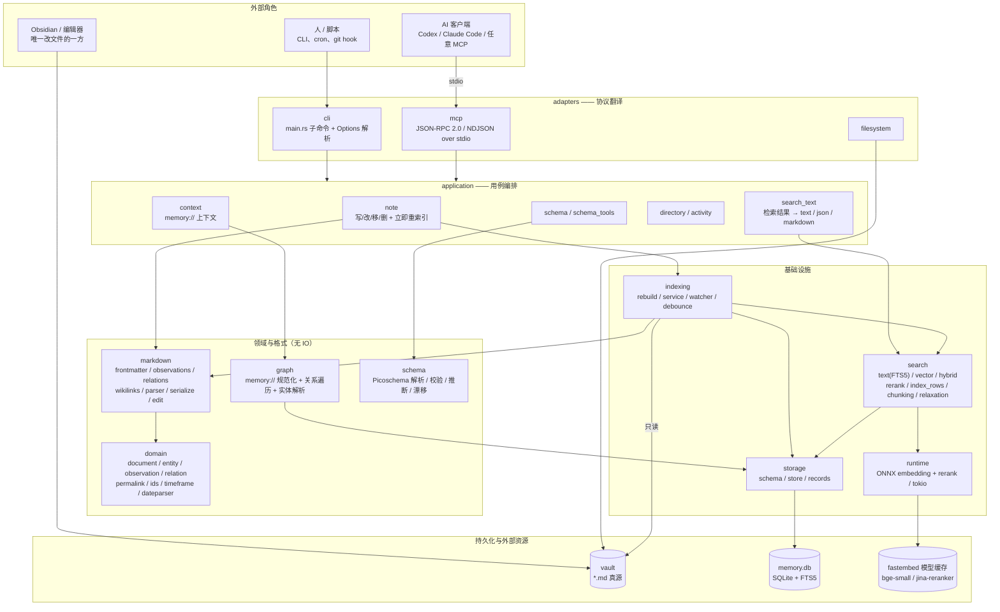

几个容易看错的依赖，图中略去了但真实存在：

- `search::vector` 复用 `search::text`：混合检索的 FTS 腿、以及向量腿的行过滤，
  都是直接调 `search_text`（`src/search/vector.rs`）。
- `application::note` 写完文件后回调 `indexing::service`，所以 MCP 的写工具
  不需要外部再跑一次 `reindex`。
- `indexing` 是唯一"读 vault"的路径（`markdown_files` + `load_indexed_document`）；
  `storage` 从不碰文件。

---

## 2. 数据存储

### 2.1 磁盘上有什么

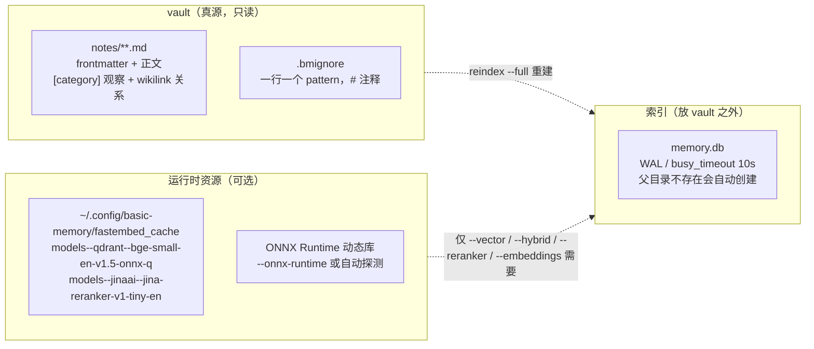

忽略规则（`indexing::watcher`）：点**目录**（`.obsidian/`、`.basic-memory/`）、
`node_modules`、非 Markdown 文件，外加 `.bmignore`。点文件不忽略。

### 2.2 表关系

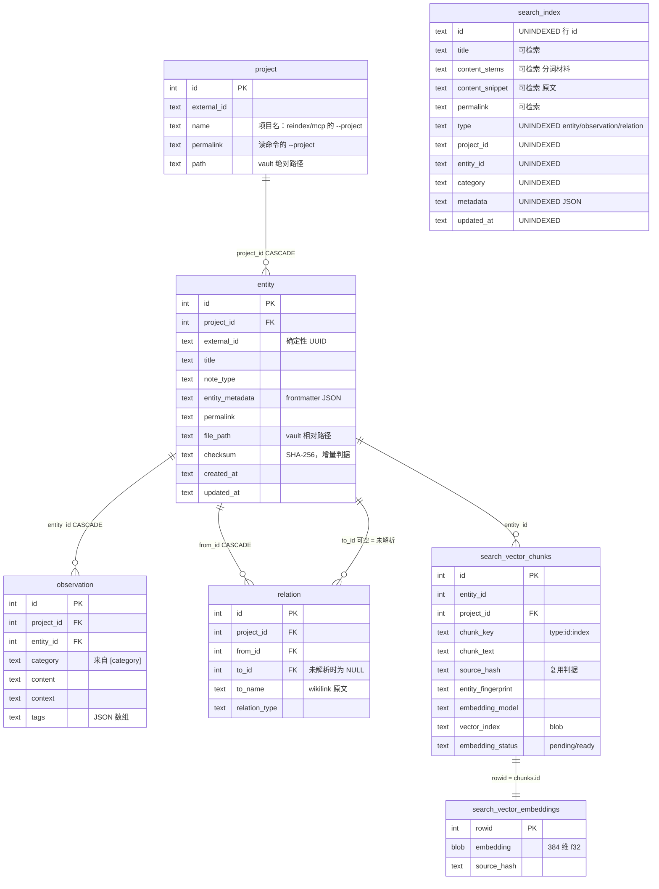

`search_index` 是 FTS5 虚表（`tokenize='unicode61 tokenchars 0x2F'`，`prefix='1,2,3,4'`），
列顺序照抄参考实现；`file_path`、`from_id`、`to_id`、`relation_type`、`created_at` 也是
`UNINDEXED` 携带列，图上为省地方没列。

### 2.3 一行 Markdown 落到哪几张表

| Markdown 里的东西 | 落到 | 说明 |
|---|---|---|
| frontmatter `title` / `type` | `entity.title` / `entity.note_type` | `type` 保留作者拼写，比较时走 `normalize_note_type` |
| frontmatter 其它键 / `tags` | `entity.entity_metadata` | 整体存 JSON；检索的 `metadata_filters` 在它上面跑 |
| `- [fact] 内容` | `observation(row)` | `category=fact`，`content=内容` |
| `relation_type [[目标]]`、`[[目标]]` | `relation(row)` | `to_name` 存原文；目标不存在则 `to_id` 为 `NULL`（unresolved） |
| 文件本身 | `entity.file_path` + `checksum` | checksum 决定"这次要不要重写索引" |
| ↳ 每一条 entity/observation/relation | 一条 `search_index` 行 | `content_stems` 由**标题/正文/permalink/文件路径/tags 的变体**拼成（`search::index_rows`） |
| 正文（仅 `--embeddings`） | `search_vector_chunks` + `search_vector_embeddings` | 900 字符切块、120 重叠；向量按 `source_hash` 复用 |

三个身份标识，别混：

- `project.name` = 写命令的 `--project`（未规范化，如 `My Vault`）；
- `project.permalink` = 读命令的 `--project`（规范化，如 `my-vault`）；
- `entity.external_id` = `deterministic_uuid(project_permalink + file_path)`，
  所以**重建索引、原子保存都不会换 id**；`move_file` 会把 destination 按原 id 重写，
  改名因此保住 permalink 与入链。

---

## 3. 写入与索引流程

### 3.0 索引什么时候被刷新

先给结论，再给流程图。索引是派生数据，**只有下面这几个入口会写它**：

| 触发 | 走的路径 | 范围与行为 |
|---|---|---|
| `reindex`（默认） | `IndexService::reconcile()` | 增量：逐文件比 SHA-256，相同则 `unchanged` 不重写；新/变则重解析并重写该文件的所有行；**walk 没看到的 `file_path` 会被删除（prune）**；收尾统一 `resolve_relations` |
| `reindex --full` | `rebuild_vault()` | 全量：不等 checksum，逐文件重写（`replace_document` 覆盖，entity id 保持）；prune 陈旧行；写 `parser_version` 标记 |
| `watch` | 启动时**先做一次全量 reconcile**，再进事件循环 | 循环内按事件做单文件 `index_file` / `remove_file` / `move_file`（1000ms 去抖，见 §3.2） |
| `mcp` | 启动时 reconcile 一次（`ensure_project` → `reconcile()`） | 首次接客户端不必先手动 `reindex`；之后每个写工具调用后 `force_index_file`（见 §3.3）。**进程运行期间不感知外部改动** |
| `reindex --embeddings` | 先 reconcile 文本索引，再重建向量 | 向量是另一套派生数据：`source_hash` 未变的 chunk 复用已存向量；**普通 `reindex` 不动向量**（见 §3.4） |
| 索引文件被删 / 首次运行 | `Store::open` 建表 | 得到空索引，内容要等下一条上述命令才补上 |

不会触发刷新的：`status` / `search` / `context` / `schema` 只读 store；也没有"发现 vault
变旧就自动重建"的逻辑。**主动全量扫 vault 的只有三处**：`reindex`、`watch` 启动、`mcp` 启动。

两个衍生结论：

- `reconcile` 的 prune 按 `--project` 定位，所以用**写错的 `--vault` + 同一个 `--project`**
  启动 `mcp`/`watch`，会把该项目所有索引行删掉（实测 `entities: 1 → 0`）。Markdown 不受影响，
  `reindex --full` 即可恢复。
- 常驻进程与外部编辑的分工：`watch` 负责"文件变了就更新"，`mcp` 只负责"启动时对齐 + 写工具后同步"。
  两者同时指向一个 vault 没问题（索引的写操作由 SQLite 的 WAL + `busy_timeout=10s` 串行化），
  但**别指望 `mcp` 自己发现 Obsidian 的改动**。

### 3.1 `reindex`（全量 / 增量）

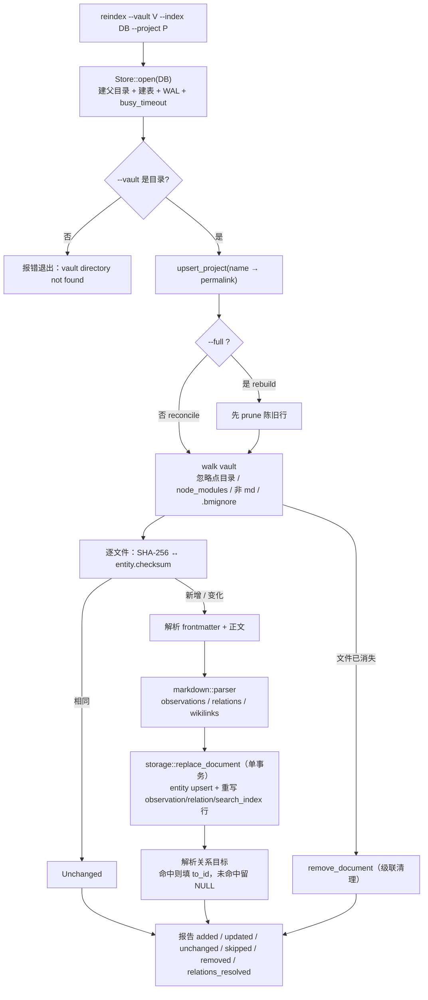

要点：

- 增量与全量走同一条流水线，全量多一步 prune；两者结果收敛（`tests/incremental_golden.rs`）。
- malformed frontmatter 的文件计入 `skipped`，不会中断整轮。
- **索引从不改写 vault**：这条路径只读文件。

### 3.2 `watch`（Obsidian 开着时的实时同步）

运行期日志走 stderr，默认 `info` 一行一个批次（`RUST_LOG=auto_memory=debug` 加事件级与忽略原因，
`RUST_LOG=off` 静音）；stdout 只在退出时给一份 `{"batches":N}`。SIGINT 与 SIGTERM 都是优雅退出：
先冲刷待处理窗口再报数（`indexing::watcher::log_watch_report`、`main.rs::shutdown_signal`）。

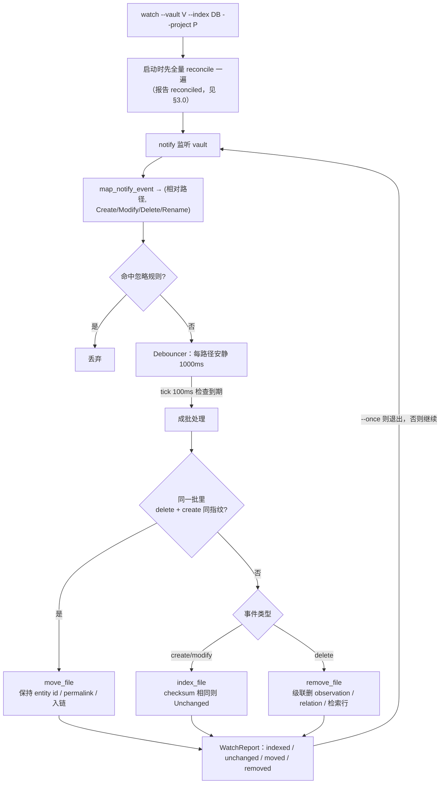

Obsidian 的原子保存（临时文件 rename 覆盖）被识别为**一次更新**，不是删除 + 新建；
文件树里的改名被识别为**移动**，所以 permalink 和别人的 wikilink 都不断。

### 3.3 MCP 写工具（写入即索引）

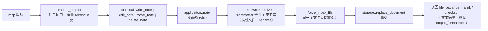

所以 MCP 写完立刻能搜到，不需要外部 `reindex`；`application::note` 是文件与索引之间
唯一的写入口，两边不会漂移。但 startup 那次 reconcile 之后再没有"扫 vault"的动作：
运行期间用 Obsidian 改了文件，要么等下次重启，要么另起 `watch`。

### 3.4 向量索引（`reindex --embeddings`）

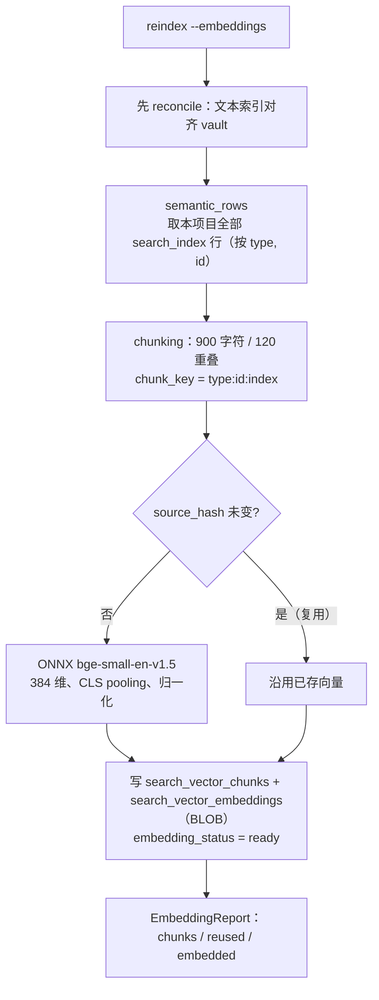

向量存 BLOB、在 Rust 里算余弦，而不是 `sqlite-vec` 的 `vec0` 虚表：两者都是精确 KNN，
结果与参考实现逐行相等，区别只落在 `vector_index` 标记（`blob`）上。

---

## 4. 数据检索流程

入口映射先摆清楚（同一个引擎，不同外壳）：

| 入口 | 走哪条路 |
|---|---|
| `search <query>` / `search_notes(query, search_type="text")` | §4.1 文本 |
| `search --vector` / `search_type="vector"｜"semantic"` | §4.2 向量 |
| `search --hybrid` / `search_type="hybrid"` | §4.3 混合 |
| `search --reranker`（或 MCP 加 `--reranker`） | §4.1–4.3 之后追加 §4.4 |
| `context <memory://…>` / `build_context` | §4.5 图遍历 |
| `recent_activity`、`list_directory` | 走存储直查 + 同一套 hydration（本节不含） |

### 4.1 文本检索（FTS5）

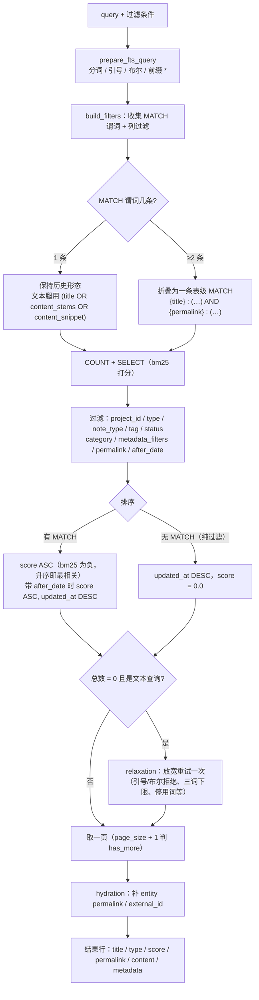

两个实测坑写在流程里：`--type`（entity 行）与 `--category`（默认收敛到 observation 行）
相交必为空；`title` 腿与文本腿原来会撞出 FTS5 的 "unable to use function MATCH…"，
现在由上面那条"≥2 条就折叠"分支处理。

### 4.2 向量检索

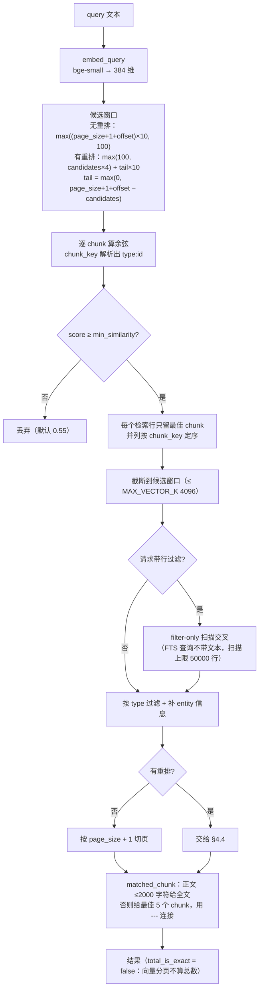

### 4.3 混合检索（FTS + 向量 融合）

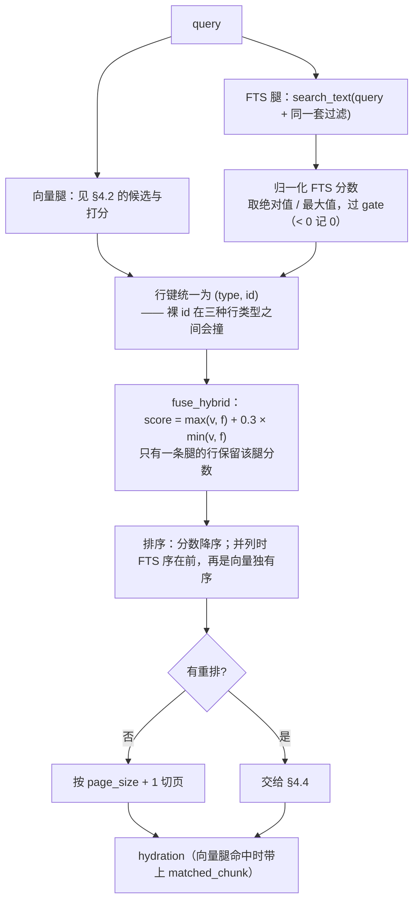

融合公式与常量照抄参考实现：`max + 0.3 × min`，版本标记 `max+0.3*min/v1`。
向量腿在融合窗口外还多取 10 倍 chunk（无重排时）以便融合有足够候选。

### 4.4 重排（可选支路，默认关闭）

参考实现默认关闭（首次运行要下模型、且增加延迟），本端一致：只有 `--reranker`
或 `--reranker-fixture` 才启用。

### 4.5 上下文检索（图遍历）

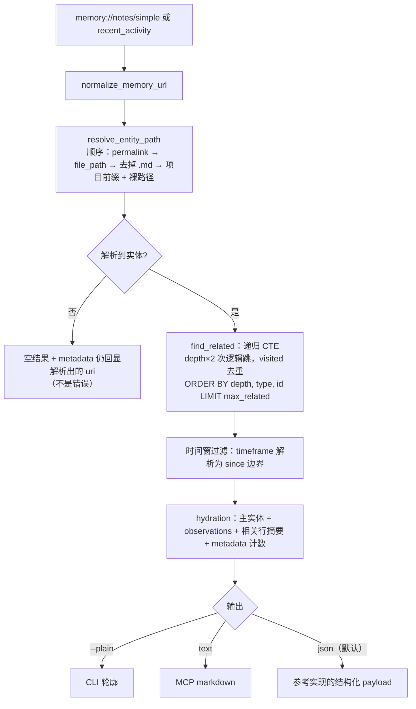

遍历顺序由 `ORDER BY depth, type, id` 决定，`max_related` 截断因此是有语义的；
这条 SQL 与参考实现逐字一致（含 `LIMIT`），改它就会改 golden。

`recent_activity` 复用同一套 hydration：它等价于"没有 `memory_url` 的 build_context"，
先按 `updated_at DESC` 取最近的实体再走同一段遍历。

---

## 5. 常量与出处

| 常量 | 值 | 位置 |
|---|---|---|
| 最小余弦相似度 | `0.55` | `search::vector::DEFAULT_MIN_SIMILARITY` |
| 向量候选基准 / 硬上限 | `100` / `4096` | `DEFAULT_VECTOR_K` / `MAX_VECTOR_K` |
| 混合融合 | `max + 0.3 × min`（`max+0.3*min/v1`） | `search::vector::FUSION_BONUS` |
| FTS gate | `0.0` | `FTS_GATE_THRESHOLD` |
| 向量腿过滤扫描上限 | `50000` 行 | `VECTOR_FILTER_SCAN_LIMIT` |
| chunk 长度 / 重叠 | `900` / `120` 字符 | `search::chunking` |
| 小笔记全文阈值 / 命中 chunk 数 | `2000` / `5` | `SMALL_NOTE_CONTENT_LIMIT`、`TOP_CHUNKS_PER_RESULT` |
| 重排窗口 / 池放大 / 文档截断 | `20` / `×4` / `2000` | `runtime::rerank` |
| 嵌入模型 / 维度 | `BAAI/bge-small-en-v1.5`（onnx-q）/ `384` | `search::embedding` |
| 重排模型 | `jinaai/jina-reranker-v1-tiny-en` | `runtime::rerank` |
| watch 去抖 / tick | `1000ms` / `100ms` | `indexing::watcher` |
| SQLite | WAL、`busy_timeout=10000`、`synchronous=NORMAL`、`cache_size=-64000`、`wal_autocheckpoint=1000` | `storage::store` |
| FTS5 分词 | `unicode61 tokenchars 0x2F`，`prefix='1,2,3,4'` | `storage::schema` |
| schema 版本 | `1` | `storage::schema::SCHEMA_VERSION` |
| context 默认 | depth `1`、timeframe `7d`、page `1`、page-size `10`、max-related `10` | `main.rs::context_command` |

---

## 6. 想继续往下读

| 主题 | 文档 |
|---|---|
| 安装、索引、MCP 接入、排障 | [integration-guide.md](integration-guide.md)（中文）、[usage.md](usage.md) |
| Markdown 格式契约（frontmatter / observation / permalink / FTS 行模型） | [data-format.md](data-format.md) |
| 检索行为契约（FTS5、向量、融合、过滤、分页） | [search-spec.md](search-spec.md) |
| `build_context` / `memory://` / `recent_activity` | [context-spec.md](context-spec.md) |
| MCP 工具清单、参数、响应模型 | [mcp-spec.md](mcp-spec.md) |
| 参考实现基线与逐条证据 | [reference.md](reference.md) |
| 设计取舍与刻意不用的模式 | [patterns.md](patterns.md) |
