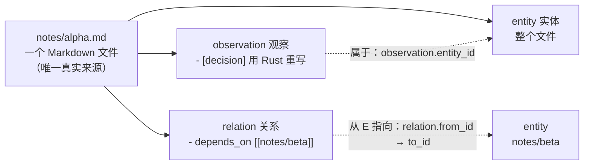

# 术语表（Glossary）

> 目的：把散落在 spec、代码、数据库、JSON 里的术语集中定义一次，解决"observation 到底是什么意思"这类问题。
>
> 读法：**英文是正式名——它是代码、数据库表、SQLite 列、JSON 字段、MCP 参数里的契约，不可随意改名或意译**；中文只是帮助理解。
> 术语表与代码不一致时，以代码和 [data-format.md](data-format.md) 为准。

---

## 0. 一张图看懂三者关系

三句话讲完：

1. 一个 `.md` 文件解析成 **1 个 entity + N 个 observation + M 个 relation**（外加一份 wikilink 列表）。
2. 三者**同源**：都来自同一次解析，都是索引里的派生数据。删掉索引可以靠文件完整重建；删掉文件则三者一起消失（数据库级联删除）。
3. 区别只有一句话：**observation 是"内容"，relation 是"边"**。observation 属于某个 entity，relation 连接两个 entity。

代码落点：`ParsedDocument`（`src/domain/document.rs`）同时持有 `observations: Vec<Observation>` 与 `relations: Vec<Relation>`——它们本来就是兄弟字段。

| 中文 | 正式名 | 是什么 | 在 Markdown 里 | 在存储里 |
|---|---|---|---|---|
| 实体 | entity | 一个 Markdown 文件 | 整个 `.md` 文件 | 表 `entity` |
| 观察 / 记录 | observation | 实体内部的**一条结构化事实** | `- [decision] 内容` | 表 `observation`（`entity_id` 外键） |
| 关系 | relation | 两个实体之间的**有向边** | `- depends_on [[X]]` 或正文里的 `[[X]]` | 表 `relation`（`from_id` → `to_id`） |
| 双链 | wikilink | 正文里的 `[[...]]` 记号本身 | `[[Target\|显示名]]` | 不单独建表，解析后变成 relation |

---

## 1. 核心术语

### entity — 实体

**定义**：索引里代表"一个 Markdown 文件"的那条记录。文件是唯一真实来源，entity 是派生出来的。

**关键字段**（表 `entity`）：`external_id`（确定性 UUID，由项目 + 文件路径派生，重建后保持稳定）、`title`、`note_type`、`permalink`、`file_path`、`checksum`、`created_at` / `updated_at`。
**唯一约束**：`(permalink, project_id)`、`(file_path, project_id)`。

**代码**：`src/domain/entity.rs`、`src/storage/schema.rs`

**易错**：
- entity 不等于文件本身——它是文件的索引投影。删 `.basic-memory/` 不会毁掉知识，重新索引就能重建。
- 直接改数据库没用，下次索引会被文件覆盖。

### note — "笔记"

**定义**：口语词，指一个 `.md` 文件，正式名就是 entity。文档里的 "note file" 说的就是"一个 entity"。

**易错**：不要和 frontmatter 里的 `type: note` 搞混——后者是 note_type 的默认值（一个类型名），不是文件。

### observation — 观察

**定义**：实体内部的**一条结构化事实**。它**不产生边**，只属于它所在的那个 entity（`observation.entity_id` 外键，随 entity 级联删除）。

**写法**：`- [category] content #tag (context)`，其中：
- `category` 可选；**缺省时数据库存字符串 `note`**（不是 NULL）
- `content` 必填；`#tag` 保留在 content 文本里，同时也被抽取进 `tags`
- `context` 是可选的行尾括号

**代码**：`src/domain/observation.rs`、`src/markdown/observations.rs`
**语法细则**：见 [data-format.md](data-format.md) §6

**易错**：
- 任务清单 `[ ] [x] [-]`、时间戳 `[1:02:03.500]`、Markdown 链接 `[text](url)`、纯 wikilink 行**都不是** observation。
- 围栏代码块内的内容、引用块（Obsidian callout）内的内容不算。
- 顺序 = 文档顺序（这点和 relation 不同：relation 按 `(relation_type, to_name)` 去重，再按字典序入库）。

### relation — 关系

**定义**：从**一个** entity 指向**另一个** entity 的有向边。反向边**不会**自动生成。

**两个来源**：
1. 显式：`- depends_on [[Target]]`
2. 隐式：正文里任何 `[[...]]` 都变成一条 `links_to` 关系

**字段**（表 `relation`）：`from_id`（必有）、`to_id`（**可为 NULL = 悬空链接**）、`to_name`（原文写的那个字符串，可能带项目前缀或 `|显示名`）、`relation_type`、`context`。
**唯一约束**：`(from_id, to_name, relation_type)`

**代码**：`src/domain/relation.rs`、`src/markdown/relations.rs`
**语法细则**：见 [data-format.md](data-format.md) §7

**易错**：
- 目标文件不存在也能建关系（`to_id` 为 NULL）；目标文件之后建好时，这条关系会自动解析上（to_id 被填上）。
- 关系是派生数据，改数据库没用，下次索引就覆盖。
- 多词类型必须加引号：`- "multi word type" [[X]]`；不加引号不报错，但会退化成 `links_to`。
- `[[a|b]]` 指向的是 `a`，`b` 只是显示名。

### relation type — 关系类型

**定义**：显式关系行里 `[[` 之前的那段标签，例如 `depends_on`。

**隐式默认**：`links_to`——最弱、最通用的兜底类型（不是"更强"的关系）。

**校验**（`RelationType::new`）：非空、首尾无空白、不含 `[[`。

### observation category — 观察类别

**定义**：`- [category] ...` 方括号里的那一段，例如 `decision`、`requirement`、`fact`。

**缺省**：没写类别时数据库存 `note`。

**作用**：schema 校验时它作为"字段名"参与匹配；搜索时可用 `--category` 过滤。

**易错**：它**不是** note_type。字符串 `note` 既可能是默认 category，也可能是默认 type——看它出现在哪个字段里。

### wikilink — 双链

**定义**：正文里的 `[[...]]` 记号本身。

**形态**：`[[Target]]`、`[[Target|显示名]]`（指向 `Target`，显示名只影响展示）、`[[project::Target]]`（项目前缀，归一化成 `project/Target`）。

**解析**：每个 wikilink 变成一条 relation；围栏代码块里的不算。行尾的 `#bm:links_to` 指令会被移除，作用是**阻止显式关系解析**（把该行强制成普通的 `links_to`），并不会让 wikilink 消失。

**目标解析**：`to_name` 依次尝试匹配 permalink、file_path、`file_path + ".md"`、去掉 `.md` 的 file_path；命中多个时取 id 最小的那条。匹配不上就是悬空链接（`to_id` 为 NULL），目标文件出现后自动填上。详见 [knowledge-graph.md](knowledge-graph.md) §4。

**代码**：`src/markdown/wikilinks.rs`

### permalink — 永久标识

**定义**：URL 友好的稳定标识。entity、relation、observation 都有各自的 permalink。

**合成规则**：默认由文件路径生成（去扩展名、ASCII 小写、空格与下划线转连字符、CJK 保留、CJK↔ASCII 交界处补连字符）；frontmatter 里显式写的 permalink 原样保留。生成的 permalink 默认加项目前缀。
**校验规则**：非空、不含空白、不含 `//`、不含 `<` `>` `"` `|` `?`。
**合成形态**：
- observation：`<entity permalink>/observations/<category>/<content[:200]>`（超 200 字符时追加 sha256 摘要）
- relation：`<from>/<relation_type>/<to>`

**代码**：`src/domain/permalink.rs`

**易错**：permalink ≠ 文件路径。显式 permalink 改名后不变；文件路径一定会变。

### file_path — 文件路径

**定义**：项目内的相对路径，统一用 `/` 分隔。唯一约束 `(file_path, project_id)`。

**与 permalink 的区别**：file_path 是磁盘真相，改名即变；permalink 是逻辑 id，改名通常不变，所以引用（wikilink）走 permalink 解析。

### title — 标题

**定义**：frontmatter 的 `title`。缺失、空串或 `"None"` 时回退到文件名（stem）。用于展示，也用于按标题解析引用。

### note_type — 笔记类型

**定义**：frontmatter 的 `type`，默认 `note`。

**注意**：入库时**原样保存**，不做改写；比较时才经 `normalize_note_type` 归一化成 snake_case——所以 `BasicMemory`、`memory service`、`memory-service` 是同一个逻辑类型。

**代码**：`src/domain/note_type.rs`

### memory:// URL

**定义**：指向上下文入口的 URI，例如 `memory://notes/simple`；也可以裸写 `notes/simple`，归一化时补上 `memory://`。

**校验**：非空、不含 `://`、不含 `//`、不含 `<` `>` `"` `|` `?`，最长 2028 字符。

**解析顺序**（`resolve_entity_path`）：permalink 精确匹配 → file_path 精确匹配 → `file_path + ".md"` → permalink 后缀匹配（`*/<path>`，用来剥掉项目前缀）。**解析不到时返回空结果，而不是报错。**

**代码**：`src/graph/mod.rs`（`normalize_memory_url`、`resolve_entity_path`）
**契约**：规范化与校验见 [context-spec.md](../specs/context-spec.md) §1，解析与遍历见 §3

### search item type — 搜索条目类型

**定义**：`search_index.type` 字段，取值只有三种：`entity`、`observation`、`relation`。搜索的 `entity_types` 过滤用的就是这三个字符串。

**注意**：带 `--category` 过滤且未指定 `entity_types` 时，默认收窄为 `observation`。

### matched_chunk — 命中片段

**定义**：向量 / 混合检索命中时返回的文本片段。FTS（纯文本）命中时为 `null`，改用 `content` 里的预览片段。

**注意**：它属于搜索层，不是知识模型的一部分。

---

## 2. 最容易混的几对

| 容易混 | 区别 |
|---|---|
| entity vs 文件 | entity 是索引里的投影，文件是唯一真实来源；删索引用不丢知识 |
| entity vs note | "note" 是口语，正式名是 entity；`type: note` 里的 note 是类型名 |
| observation vs relation | observation 是"内容"（属于一个实体），relation 是"边"（连接两个实体） |
| permalink vs file_path | permalink 是逻辑 id（改名通常不变），file_path 是磁盘路径（改名即变） |
| permalink vs title | permalink 是解析引用用的稳定 id，title 是给人看的名字，可重复可改 |
| observation category vs note_type | 前者是实体内部条目的分类，后者是实体自身的类型；两者都可能取值 `note` |
| wikilink vs relation | wikilink 是正文里的记号，relation 是解析后的边；一个 wikilink 通常产生一条 relation |
| `links_to` vs 显式类型 | `links_to` 是兜底默认，不是"更强"的关系 |

---

## 3. 不是本项目的术语

以下词汇在代码里能搜到，但**不是领域概念**，不要拿它们指代上面的类型：

| 词 | 实际含义 |
|---|---|
| `entry` | 通用编程词：`HashMap::entry()`、目录遍历项、frontmatter `entries`（键值对列表）。**想表达 observation 时不要用 entry。** |
| `record` | 同上，"记录"只是日常说法，不是类型名 |
| `chunk` / `matched_chunk` | 搜索层切分出的原文片段 |
| `memory` | 只出现在 `memory://` URI 和项目名里，本身不是类型 |
| `parsed document` | 解析中间产物（`ParsedDocument`），不是存储层概念 |

---

## 4. 相关文档

| 想知道 | 看这里 |
|---|---|
| 完整语法契约（frontmatter / observation / relation / permalink） | [data-format.md](data-format.md) |
| 入门讲解（三个概念 + 图解 + 常见误解） | [knowledge-graph.md](knowledge-graph.md) |
| 分层结构与 SQLite 表关系 | [architecture-guide.md](architecture-guide.md) |
| 领域类型定义 | `src/domain/` |
| 数据库表结构 | `src/storage/schema.rs` |
