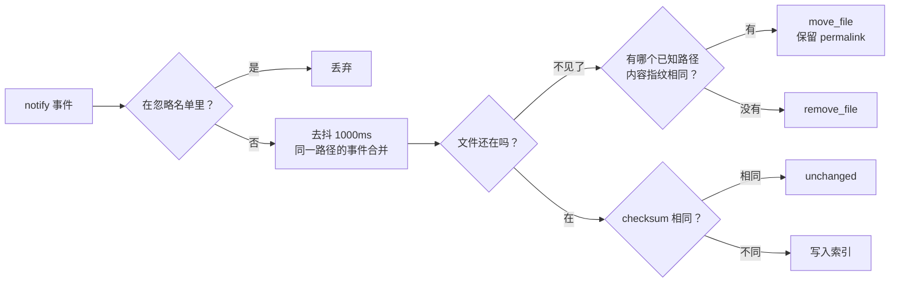

# 增量索引教学（真实数据版）

> **这份文档怎么用**：讲清"改一个文件之后，索引到底动了多少东西"，每一步都配**真跑出来的报告**。
> 数据来源见文末。
>
> 配套阅读：[vector-pipeline-tutorial.md](vector-pipeline-tutorial.md)（向量那一趟）、
> [search-pipeline-tutorial.md](search-pipeline-tutorial.md)（检索怎么用这些数据）。

---

## 1. 两条更新路径

```
                     ┌─ watch（常驻）  操作系统事件 → 去抖 → 立刻更新
改动一个 .md 文件 ───┤
                     └─ reindex（一次性）  扫描整个 vault → 与索引对账
```

| | `auto-memory watch` | `auto-memory reindex` |
|---|---|---|
| 触发 | 文件系统事件（`notify`） | 手动 / hook / cron |
| 粒度 | 只有变化的路径 | 全库对账 |
| 去抖 | **1000 ms**（同一路径的连续事件合并） | 不适用 |
| 能识别重命名 | ✅（靠内容指纹配对） | ❌（看成一次删除 + 一次新增） |
| 需要常驻进程 | 是 | 否 |

两条路径最终都落到同一套逻辑：**checksum 比对 → 变了才写**。

---

## 2. 真实的增量序列

拿 fixture vault（16 个文件，其中 1 个 frontmatter 损坏）跑一遍，每一步的命令和报告都是真的：

### 第 1 步：首次全量

```bash
auto-memory reindex --full --vault V --index DB --project oracle
```

```json
{"files_seen": 16, "documents_indexed": 15, "documents_skipped": 1,
 "documents_removed": 0, "observations": 16, "relations": 16, "relations_resolved": 15}
```

- `files_seen 16` vs `documents_indexed 15`：差的那一个是 **frontmatter 损坏**的文件，被跳过（不是报错）。
- `relations_resolved 15`：索引完统一跑一次关系解析，填上 15 条 `to_id`（剩下的是悬空链接）。

### 第 2 步：立刻再跑一次（什么都没改）

```json
{"added": 0, "updated": 0, "unchanged": 15, "skipped": 1, "removed": 0, "relations_resolved": 0}
```

**15 个文件一个都没重写。** 靠的是逐文件比对 `entity.checksum`（文件内容哈希）——
注意不是比 mtime，所以 `touch` 一下不会触发重索引。

### 第 3 步：改一篇笔记（往 `notes/simple.md` 追加一行）

```json
{"added": 0, "updated": 1, "unchanged": 14, "skipped": 1, "removed": 0, "relations_resolved": 1}
```

- 只有 **1 个** `updated`，其余 14 个照样 `unchanged`。
- `relations_resolved: 1` 值得注意：重写这篇笔记会**删掉它的关系行再重插**（新行的 `to_id` 先是 NULL），
  所以末尾那次全局解析又把它填了回去——那个 `[[projects/alpha]]` 就是这一条。

### 第 4 步：重命名一篇笔记

```json
{"added": 1, "updated": 0, "unchanged": 14, "skipped": 1, "removed": 1, "relations_resolved": 0}
```

`reindex` 把重命名看成 **一次删除 + 一次新增**。这是个重要差别，见 §4。

### 第 5 步：删掉一篇笔记

```json
{"added": 0, "updated": 0, "unchanged": 14, "skipped": 1, "removed": 1}
```

删除是级联的：该实体的 observations 一起没，**指向它的关系行也会消失**（schema 里 `to_id ... ON DELETE CASCADE`）。
下一次全量重建时，那些源笔记会被重新解析，链接以"未解析"（`to_id IS NULL`）的姿态回来。

---

## 3. 一个文件事件怎么被处理



几个细节：

- **忽略名单**（`DEFAULT_IGNORE_PATTERNS`）：`.*`、`.git`、`*.db`、`*.db-shm`、`*.db-wal`、`*.tmp`、`config.json` 等。所以 `.obsidian/` 和 `.basic-trash` 之类根本不会进队列。
- **去抖 1000 ms**：编辑器保存一个文件往往产生 3~5 个事件（写、改元数据、rename），合并后只处理一次。异步循环每 **100 ms** 醒一次来释放到期的路径。
- **重命名配对**：删除 + 新增，两边内容一致（`entity_checksum` 与 `file_checksum` 相等）→ 判定为移动，走 `move_file`，**实体 id 和 permalink 都保住**。
- **报告字段**：`WatchReport { indexed, unchanged, moved, removed, skipped }`。

---

## 4. 重命名：两条路径结果不同（重点）

同一个操作——把 `notes/unresolved.md` 改名成 `notes/unresolved-renamed.md`：

| | 走 `reindex`（对账） | 走 `watch`（实时） |
|---|---|---|
| 索引动作 | 删旧行 + 插新行 | `move_document`（原地更新 `file_path`） |
| **permalink** | **变了**：`oracle/notes/unresolved` → `oracle/notes/unresolved-renamed` | **不变**：仍是 `oracle/notes/unresolved` |
| 别人写的 `[[notes/unresolved]]` | 断链（变成未解析） | 继续解析得到 |
| 报告 | `added:1, removed:1` | `moved:1` |

实测（走 `reindex` 后查库）：

```
file_path = notes/unresolved-renamed.md
permalink = oracle/notes/unresolved-renamed     ← 变新了
```

为什么会这样：`update_permalinks_on_move` 默认是 **false**，意思是"移动时保留原 permalink"——但这条规则只有 **watcher 的 `move_file`** 会遵守；`reindex` 走的是"新增"，新增自然按新路径生成 permalink。

> 实践建议：**要保住旧链接，就让 watcher 处理重命名**（Obsidian 里改文件名就是这样）；
> 批量搬完文件再跑 `reindex` 的话，permalink 会跟着路径走。

---

## 5. 时间戳语义

| 字段 | 取值 |
|---|---|
| `entity.updated_at` | frontmatter 的 `modified`，没有就用**文件 mtime** |
| `entity.created_at` | frontmatter 的 `created`，没有就用**这一行插入的时刻**（不是文件时间） |
| `search_index.created_at/updated_at` | 从 entity 行**拷贝**，所以同一实体的所有搜索行时间戳一致 |

两条容易被坑的推论：

1. **更新不会重写 `created_at`**（UPDATE 语句里没有它）——所以"笔记创建时间"是第一次索引它的时间。
2. `created_at` 可能**晚于**文件时间：文件是 09:11:50 写的，索引是 09:11:53 跑的，那 `created_at` 就是 09:11:53。

---

## 6. 向量什么时候过期

向量是另一趟（`reindex --embeddings`），它靠**块级指纹**决定重算范围：

| 场景 | 命令输出（真实） |
|---|---|
| 首次向量化 | `{"chunks": 78, "reused": 0, "embedded": 78}` |
| 什么都没改，再跑 | `{"chunks": 78, "reused": 78, "embedded": 0}` |
| 删掉一篇（3 块） | `{"chunks": 75, "reused": 75, "embedded": 0}` |

所以"改一个字"不会让 78 块全部重算，**只有指纹变了的块会进模型**。
（比对的是每块的 `source_hash`，见 [vector-pipeline-tutorial.md](vector-pipeline-tutorial.md) §2.5。）

⚠️ **离线回放有个限制**：`--embedding-fixture` 只能复现 golden 里捕获过的文本。改动内容后新增的块会让它报错：

```
embedding reindex failed: invalid frontmatter: no captured vector for input: - [note] added later
```

这不是 bug，是回放模式的固有性质——真要用在改过的 vault 上，得接真模型。

---

## 7. 常见误解 FAQ

**Q：`touch` 一下文件会重索引吗？**
A：不会。比的是内容哈希，内容没变就是 `unchanged`。

**Q：改一行会让整个库重算吗？**
A：不会。索引层只有那一个文件 `updated:1`；向量层只有那几块 `embedded`，其余全部 `reused`。

**Q：删除一篇笔记，别人的链接会怎样？**
A：立刻消失（`to_id` 外键级联）。下次全量重建时，那些链接会以**未解析**的形态回来。

**Q：为什么 watcher 认得出重命名，`reindex` 认不出？**
A：watcher 同时看到"某路径消失"和"某路径出现"两个事件，还能拿两边的内容指纹比对；`reindex` 只做全库对账，没有这个上下文。

**Q：`malformed` 的 frontmatter 会中断索引吗？**
A：不会。它被记为 `skipped`，其余文件照常索引。

**Q：为什么 `reindex` 之后 permalink 变了？**
A：见 §4。要保留旧 permalink 就让 watcher 处理移动，或在 frontmatter 里写死 `permalink`。

---

## 8. 复现

```bash
DB=/tmp/demo.db; V=/tmp/demo-vault
cp -R tests/fixtures/vault "$V"

auto-memory reindex --full --vault "$V" --index "$DB" --project oracle   # 全量
auto-memory reindex       --vault "$V" --index "$DB" --project oracle   # 再跑一次 → unchanged

printf '\n- [note] added later\n' >> "$V/notes/simple.md"
auto-memory reindex       --vault "$V" --index "$DB" --project oracle   # → updated 1

mv "$V/notes/unresolved.md" "$V/notes/unresolved-renamed.md"
auto-memory reindex       --vault "$V" --index "$DB" --project oracle   # → added 1, removed 1
```

---

## 9. 数据从哪来

| 数据 | 来源 |
|---|---|
| 增量报告（added/updated/unchanged/removed/skipped） | 本文在上面的命令序列上实跑所得 |
| 向量复用报告（chunks/reused/embedded） | 同上，配合 `--embedding-fixture` |
| 去抖窗口、忽略名单、报告字段 | `src/indexing/debounce.rs`、`src/indexing/watcher.rs` |
| 时间戳语义 | `docs/data-format.md` §3、`tests/index_timestamps.rs` |
| 重命名行为 | `tests/obsidian_compatibility.rs`（`file_explorer_rename_keeps_incoming_links_intact` 等） |

## 10. 相关文档

| 想知道 | 看这里 |
|---|---|
| 向量化全流程 | [vector-pipeline-tutorial.md](vector-pipeline-tutorial.md) |
| 检索三条通道 | [search-pipeline-tutorial.md](search-pipeline-tutorial.md) |
| 语法与数据契约 | [data-format.md](data-format.md) |
| 术语（checksum / permalink / move …） | [glossary.md](glossary.md) |
