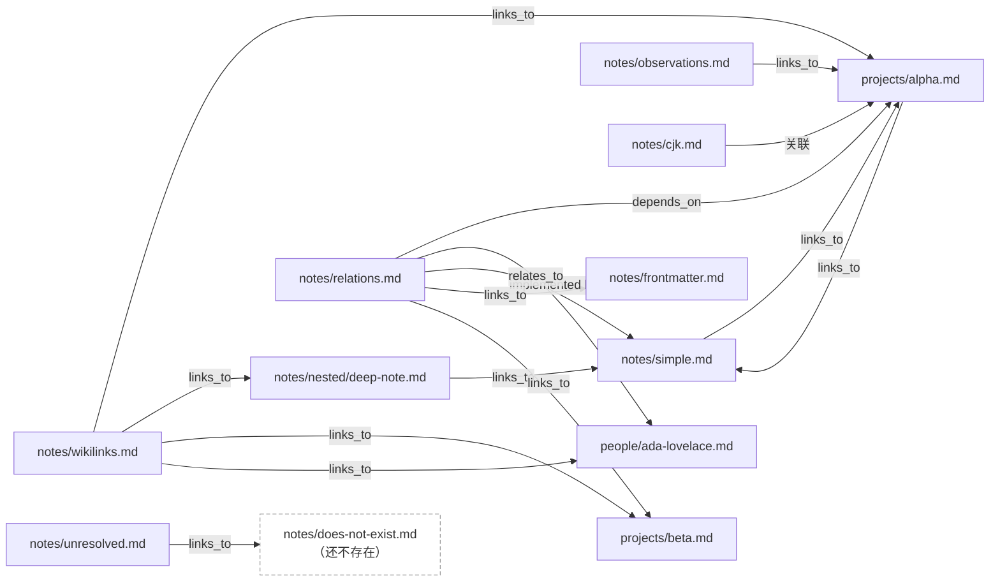
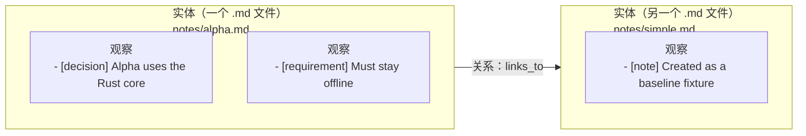
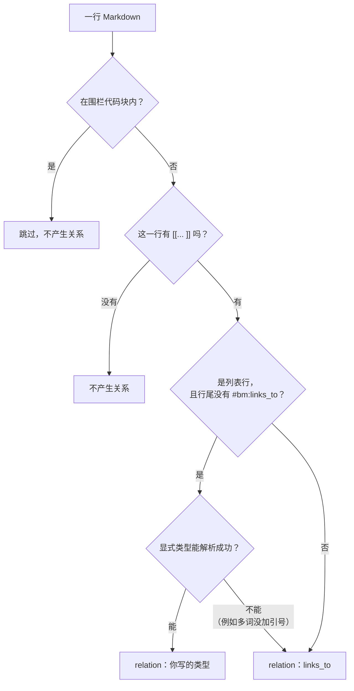
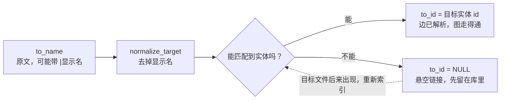
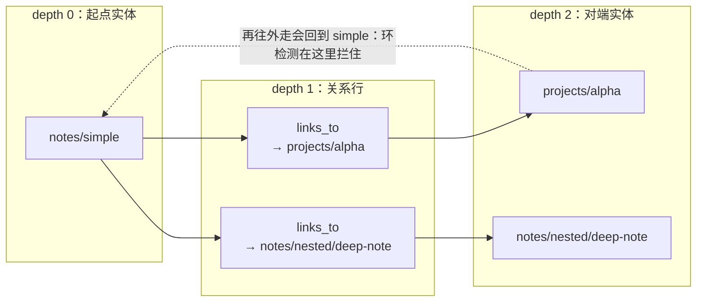

# 知识关系图入门（小白版）

> 这篇是给第一次接触本项目的人看的，不需要先读 `reference.md`。
> 想先看实现细节的，请跳到 [§7 代码地图](#7-代码地图)。
>
> 文中的图是 Mermaid，GitHub / GitLab 会直接渲染；本地看时需要编辑器的 Mermaid 预览。
> 想看会动的版本（写入、检索、图遍历三条数据流动起来）：用浏览器打开
> [`visuals/data-flow.html`](visuals/data-flow.html)。

## 0. 一句话

**你的 vault 里每个 `.md` 文件是一个"实体"，文件里写下的 `[[链接]]` 是一条"关系"，
所有这些关系连起来就是一张有向图。**

举个小例子，`tests/fixtures/vault` 里有这两个真实文件：

```markdown
<!-- notes/simple.md -->
A plain note without frontmatter. It links to [[projects/alpha]] and mentions rust.
```

```markdown
<!-- projects/alpha.md -->
Main fixture project. Links back to [[notes/simple]], forming a cycle.
```

只凭这两行文本，系统就得到：


注意这是**两条独立的有向边**，不是一条双向边。这是理解整张图最重要的一点。

### 完整一点：fixture vault 的真实关系图

把 `tests/fixtures/vault` 里**所有**关系画出来是这样（虚线节点是还不存在的目标，也就是悬空链接）：



这张图里能看到三种典型形态：

- **环**：`simple ⇄ alpha` 互相引用；
- **扇出**：`wikilinks` 一个文件指向 4 个目标；
- **悬空**：`notes/unresolved.md → notes/does-not-exist.md`，目标文件还没出现，所以 `to_id` 为空。

---

## 1. 三个基本概念

| 概念 | 英文 | 是什么 | 在文件里的样子 |
|---|---|---|---|
| 实体 | entity | 一个 Markdown 文件 | 整个 `.md` 文件 |
| 观察 | observation | 实体内部的一条结构化事实，**不连线** | `- [fact] 内容` |
| 关系 | relation | 实体与实体之间的**有向边** | `- depends_on [[X]]` 或正文里的 `[[X]]` |

用一句话区分后两个：

- **observation 属于一个实体**（"这条笔记里写了什么"）；
- **relation 连接两个实体**（"这条笔记指向谁"）。



```markdown
---
title: Alpha Project
type: project
status: active
---

# Alpha Project

Main fixture project. Links back to [[notes/simple]], forming a cycle.
                                         ↑ 这一行里的 wikilink 产生一条 relation

- [decision] Alpha uses the Rust core    ← observation，只属于 Alpha 自己
- [requirement] Must stay offline         ← observation
```

---

## 2. 关系是从哪来的

有两种来源。

### 2.1 隐式关系：所有行内 wikilink 都是 `links_to`

只要正文里出现 `[[某处]]`，解析器就自动产生一条 `links_to` 关系：

```markdown
See also [[notes/nested/deep-note]].
```

```
当前文件 ──links_to──▶ notes/nested/deep-note
```

`links_to` 是**唯一内建的关系类型**，含义就是最弱的"我提到了它"。
解析器无法从一句普通的话里判断你是"依赖"还是"实现"，所以统一叫 `links_to`。

### 2.2 显式关系：`- <类型> [[目标]]`

想表达更强语义，就自己写一个类型：

```markdown
- depends_on [[projects/alpha]]
- "implemented by" [[people/ada-lovelace]]
- relates_to [[notes/simple]] (primary source)
```

规则（见 `src/markdown/relations.rs`）：

- 显式类型**只能写在列表行**上（`- `、`* `、`+ ` 开头）；
- 非列表行里的 `[[...]]` 一律按隐式 `links_to` 处理；
- 列表行末尾加 `#bm:links_to` 可以压制显式解析，强制当行内链接处理；
- 类型名可以是任意单词，比如 `depends_on`、`works_at`、`relates_to`；
- **多个单词的类型必须加引号**：`"implemented by" [[X]]`；
  写成不加引号的 `implemented by [[X]]` 时，显式类型解析失败，会退回成一条
  `links_to`，而不是 `implemented by`；
- 行尾可以带一个括号上下文：`(primary source)`，它只做说明，不参与匹配。

> 代码块（`` ``` `` 和 `` ~~~ `` 围起来的内容）里的 `[[...]]` 不算关系，整块被跳过。

把上面的规则画成一张判断图：



---

## 3. 关系在数据库里长什么样

每条关系在 `relation` 表里是**一行**（`src/storage/records.rs` 的 `RelationRow`）：

| 字段 | 含义 | 备注 |
|---|---|---|
| `from_id` | 起点实体 | 一定有值，必然能解析到 |
| `to_id` | 终点实体 | **可以为空**，为空表示目标还没找到 |
| `to_name` | 你原文写的目标 | 可能带 `|显示名`，如 `projects/beta|Beta` |
| `relation_type` | 关系类型 | `links_to`、`depends_on`、…… |
| `context` | 括号里的说明 | 可空 |

三条容易踩的规则：

1. **只存出边。** 不会自动生成反向边，"谁引用了我"（backlink）是查询时用 `to_id` 现算的。
2. **同一对关系不能重复。** 约束是 `UNIQUE (from_id, to_name, relation_type)`；
   但 `A depends_on B` 和 `A links_to B` 可以同时存在，所以它其实是**有向多重图**。
3. **`to_name` 保留原文。** `[[projects/beta|Beta]]` 存下来是 `projects/beta|Beta`，
   到解析目标时才把 `|Beta` 去掉。所以显示名不影响指向谁。

---

## 4. 目标是怎么"解析"的

`[[某处]]` 里的"某处"只是个字符串，系统需要把它对上某个真实文件，这个过程叫**解析（resolve）**。

匹配方式（`src/storage/store.rs` 的 `resolve_relations`）：`to_name` 只要命中下面任意一种就算解析成功，多个命中时取 id 最小的那条：

```
permalink = to_name
file_path = to_name
file_path = to_name + ".md"
去掉 ".md" 的 file_path = to_name
```

整个过程可以画成一条流水线：



- 匹配成功：`to_id` 被填上，这条边两端齐全，图走通了；
- 匹配失败：`to_id` 保持 `NULL`，这条边叫**未解析 / 悬空链接**。

真实例子，`tests/fixtures/vault/notes/unresolved.md`：

```markdown
This links to [[notes/does-not-exist]] before the target exists.
```

因为 `notes/does-not-exist` 不存在，这条关系会一直躺在库里、`to_id IS NULL`。
以后你补上这个文件、再跑一次索引，它就会被填上。

### 什么时候链接会断

- **文件改名，且 `update_permalinks_on_move = true`**：permalink 跟着新路径重算，
  别人写的旧 `[[旧permalink]]` 就匹配不上了（详见 `docs/reference.md` §6c）。
- **显式改了 frontmatter 里的 `permalink`**：同理，旧引用失效。

`update_permalinks_on_move = false`（默认）会保住旧 permalink，代价是旧路径
不能随便复用，否则会撞 `permalink` 唯一约束。

---

## 5. 这张图怎么被"走"一遍

入口是 `build_context`（MCP）或 `context`（CLI），参数是一个 `memory://` URL：

```
memory://notes/simple
        │
        ▼
   找到起点实体
        │
        ▼
   find_related：从起点往外一层层爬
        │
        ▼
   主实体 + 观察 + 相关行的摘要
```

从起点出发的深度是这样递增的（一个逻辑"跳" = 关系行 + 对端实体，共两层 depth）：



`find_related` 是一个递归 CTE（`src/storage/store.rs`），有三个关键行为：

1. **一"跳"算两层 depth。** 先产出关系行（depth = n+1），再产出对端实体（depth = n+2），
   所以 `max_depth = depth * 2`；
2. **会做环检测。** 像 `simple ⇄ alpha` 这种互相引用，不会无限循环；
3. **顺序和截断是有语义的。** 按 `ORDER BY depth, type, id LIMIT max_related` 返回，
   所以"离得近的"先出现，`max_related` 截断谁是有确定规则的。

调用方默认只取一跳（`depth = 1`），够用又不会把整张图拉出来。

---

## 6. 新手最容易误解的地方

| 误解 | 事实 |
|---|---|
| "我链接了它，它也就算链接了我" | 不会，反向边不自动生成 |
| "`links_to` 是一种特殊的、更强的关系" | 恰恰相反，它是最弱、最通用的兜底类型 |
| "关系行可以直接改" | 关系是从 Markdown 重新解析出来的派生数据，改数据库没用，下次索引就覆盖 |
| "多词类型随便写" | 必须加引号；不加引号不会报错，但会退化成一条 `links_to` |
| "`[[a|b]]` 指向的是 b" | 指向的是 `a`，`b` 只是显示名 |
| "改名后系统会帮我改别人的引用" | 不会，目前没有 backlink 回写（见 `docs/mcp-spec.md` 的说明） |
| "代码块里的链接也算" | 不算，围栏代码块被整体跳过 |
| "`to_name` 就是文件名" | 不一定，它是你原文写的字符串，可能带项目前缀、`|显示名`，也可能根本不存在 |

---

## 7. 代码地图

想继续往下读，按这个顺序：

| 想知道 | 看这里 |
|---|---|
| 关系从 Markdown 怎么解析出来 | `src/markdown/relations.rs`、`src/markdown/wikilinks.rs` |
| 关系的数据结构 | `src/domain/relation.rs`、`src/storage/records.rs` 的 `RelationRow` |
| 表结构和约束 | `src/storage/schema.rs` 的 `relation` 表 |
| 目标怎么解析 | `src/storage/store.rs` 的 `resolve_relations`、`normalize_target` |
| 图怎么遍历 | `src/storage/store.rs` 的 `find_related`、`src/graph/mod.rs` |
| 遍历出来的上下文 | `docs/context-spec.md`、`docs/architecture-guide.md` §4.5 |
| 架构图 / ER 图 | `docs/architecture-guide.md` §2.2 |
| 会动的数据流图 | `docs/visuals/data-flow.html`（浏览器打开） |
| 可参考的真实样例 | `tests/fixtures/vault/notes/{simple,wikilinks,relations,unresolved}.md` |
| 参考实现的行为依据 | `docs/reference.md` §6b / §6e |
