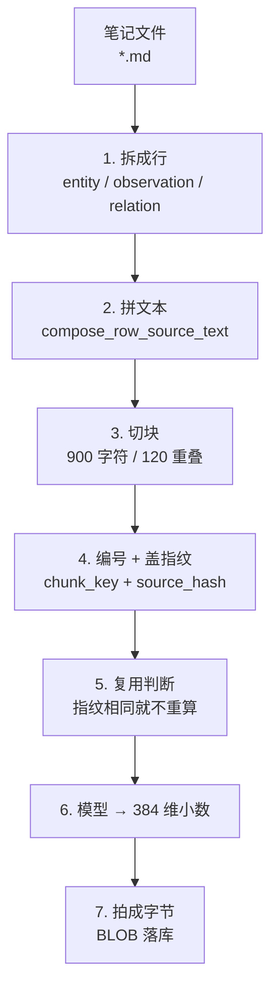

# 向量化全流程教学（真实数据版）

> **这份文档怎么用**：它用仓库里真实的 fixture 笔记和**参考实现跑出来的真实数据**，把"一篇笔记
> 变成一堆向量"的每一步拆开讲。所有数字都不是编的——来源见文末「数据从哪来」。
>
> 适合：第一次接触向量检索、想知道数据在每一步长什么样的人。
>
> 🎬 **动画版**：交互页 [visuals/vector-pipeline.html](visuals/vector-pipeline.html)（7 步自动播放，可单步 / 暂停）；
> 需要贴到别处就用 GIF：[visuals/vector-pipeline.gif](visuals/vector-pipeline.gif)（1120×1200，8.7 秒）。
> 投屏 / 上传视频平台用 MP4：[visuals/vector-pipeline.mp4](visuals/vector-pipeline.mp4)（H.264，8.5 秒）。
> 想一次看完向量化 + 检索 14 步：[visuals/pipeline-tutorial.mp4](visuals/pipeline-tutorial.mp4)（合并版，带章节标记）。带背景音的版本是 [visuals/pipeline-tutorial-music.mp4](visuals/pipeline-tutorial-music.mp4)。
> 要中文旁白讲解的用 [visuals/pipeline-tutorial-narrated.mp4](visuals/pipeline-tutorial-narrated.mp4)（2 分 29 秒，神经语音，每步按讲解长度展开）。

---

## 1. 先建立三条主线

### 1.1 真源和派生

```
vault/*.md           ← 唯一真源，人写的
     │
     │  索引（随时可删可重建）
     ▼
memory.db
   ├── entity / observation / relation   精确查找、图遍历
   ├── search_index (FTS5)               关键词检索
   └── search_vector_chunks/embeddings   语义检索
```

> **不变量**：删掉 `memory.db` 不会丢任何知识，重新索引就能恢复。

### 1.2 两条时间线

| | 什么时候更新 | 影响什么 |
|---|---|---|
| 文字索引 | 写完笔记**立刻**（`write_note` / `edit_note` 内部就调） | 关键词搜索（FTS）、`memory://` 解析、图遍历 |
| 向量索引 | **另外一趟**：`auto-memory reindex --embeddings` | 语义搜索、混合搜索 |

**结果**：刚写完的笔记，关键词搜索马上能搜到，但语义搜索要等向量那趟跑完。这是最常见的困惑来源。

### 1.3 七步流水线



（下面按这七步走，小节标题里的「第 N 步」与上图编号一致。）

---

## 2. 逐步分解：以 `notes/simple.md` 为例

### 2.0 原文

`tests/fixtures/vault/notes/simple.md`（**没有 frontmatter**）：

```markdown
# Simple Note

A plain note without frontmatter. It links to [[projects/alpha]] and mentions rust.

- [note] Created as a baseline fixture
```

> 没有 frontmatter 时，title 取**文件名**（`simple`），type 取默认 `note`，permalink 按路径生成。
> 所以它的标题**不是** `# Simple Note`——H1 只是正文。

---

### 2.1 第 1 步：一篇笔记 → 3 行

索引不把笔记当"一坨"。它先产生三种行：

| 类型 | title | 它是谁 |
|---|---|---|
| `entity` | `simple` | 整篇笔记本身 |
| `observation` | `note: Created as a baseline fixture...` | 那条 `- [note] ...` 行 |
| `relation` | `simple -> Alpha Project` | 正文里那个 `[[projects/alpha]]` |

**一条笔记条目、一个链接，各算一行。**

---

### 2.2 第 2 步：每行拼一段"送给模型看的话"

这一步并不是直接拿 Markdown 原文拼接。真实链路是：

```text
simple.md
  -> 解析成 ParsedDocument
       |- frontmatter.title = "simple"
       |- content = 去掉 frontmatter 后的正文
       |- observations = [{ category, content, tags, context }, ...]
       `- relations = [{ relation_type, target, context }, ...]
  -> Store::replace_document()
       |- entity_row(...)
       |- observation_row(...)
       `- relation_row(...)
  -> search_index（SQLite FTS5 表）
  -> Store::semantic_rows()
  -> SemanticRow
  -> compose_row_source_text()
  -> 送给 embedding 模型的文本
```

三种 row 读取的字段不同：

| 类型 | 公式 |
|---|---|
| `entity` | 标题 + 空行 + permalink + 空行 + 正文 |
| `observation` | 标题 + 空行 + permalink + 空行 + 类别 + 空行 + 内容 |
| `relation` | 标题 + 空行 + permalink + 空行 + 关系类型 |

#### 2.2.1 每个拼接项的数据从哪里来

| 拼接项 | 来源 | 具体说明 |
|---|---|---|
| entity 标题 | `ParsedDocument.frontmatter.title` | frontmatter 的 `title`；没有 frontmatter 或没有该字段时，解析阶段回退到文件名，例如 `simple.md -> simple` |
| entity permalink | `replace_document()` 传入的 entity permalink | frontmatter 显式指定或索引阶段生成的完整 permalink |
| entity 正文 | `ParsedDocument.content` | 原始 Markdown 去掉 frontmatter 后的 body；仍包含 H1、段落、`- [note] ...` 原始行和 wikilink |
| observation 标题 | `observation_row()` 合成 | `"{category}: {content 前100字符}..."`；不是 `observation` 表里已有的字段 |
| observation permalink | `observation_row()` 合成 | 由 entity permalink、`observations`、category 和内容生成的 slug 组成 |
| observation 类别 | `Observation.category` | 行首 `[类别]`；没有类别时使用默认值 `note` |
| observation 内容 | `Observation.content` | 去掉 `- [类别]`、内联标签和尾部 `(context)` 后的实际内容 |
| relation 标题 | `relation_row()` 合成 | 目标已解析时是 `来源标题 -> 目标标题`；目标尚未解析时暂时只有来源标题 |
| relation permalink | `relation_row()` 合成 | 目标解析后，由来源 permalink、关系类型和目标 permalink/名称生成 |
| relation 类型 | `Relation.relation_type` | 例如显式关系的 `depends_on`，或正文 wikilink 产生的 `links_to` |
| relation 内容 | 不存在 | relation row 的 `content_snippet` 当前始终为 `NULL` |

这些字段先写入 `search_index`。之后 `Store::semantic_rows()` 只读取以下列：

```sql
SELECT id, type, title, permalink, content_snippet,
       category, relation_type, entity_id
FROM search_index
WHERE project_id = ?1
ORDER BY type, id
```

所以 `SemanticRow` 里的数据不是重新解析 Markdown 得到的，而是从已经构建好的 `search_index` row 映射出来的。

> **这里的“正文”和“内容”不是一个层级：**
>
> - `entity` 的正文是整篇笔记的 body，包含 observation 原始行和 wikilink。
> - `observation` 的内容只是单条 observation 提取后的 text，不含类别、标签和 context。
> - `relation` 没有独立的正文或内容字段，语义主要由 title、permalink 和 `relation_type` 表达。

例如原始行：

```markdown
- [note] Created as a baseline fixture
```

会得到：

```text
category        = note
content         = Created as a baseline fixture
observation title = note: Created as a baseline fixture...
```

而 entity 的正文仍然保留原始 Markdown 行：

```markdown
- [note] Created as a baseline fixture
```

#### 2.2.2 最终拼出来的三段

真实结果如下，`\n` 表示换行：

```
[entity:9]
simple

oracle/notes/simple

# Simple Note

A plain note without frontmatter. It links to [[projects/alpha]] and mentions rust.

- [note] Created as a baseline fixture

[observation:11]
note: Created as a baseline fixture...

oracle/notes/simple/observations/note/created-as-a-baseline-fixture

note

Created as a baseline fixture

[relation:10]
simple -> Alpha Project

oracle/notes/simple/links-to/oracle/projects/alpha

links_to
```

拼接规则只有两条：

1. 按顺序保留非空字段。
2. 字段之间统一插入一个空行，即 `\n\n`。

> **为什么 observation 的标题总带 `...`？** 标题固定构造成 `类别: 内容前100字符...`；
> 即使内容不足 100 字符也会带 `...`，并不表示这里发生了截断。完整、无省略号的内容在
> observation 行的 `content_snippet`（这里展示为最后一段）里。

---

### 2.3 第 3 步：一段话 → 若干块

切块规则（`src/search/chunking.rs`）：

> 每个条件分支的输入、预期输出和覆盖测试见 [chunking-walkthrough.md](chunking-walkthrough.md)。

1. **markdown 标题、列表项**是天然边界，先按它们切
2. 某一节仍超过 **900 字符**，就按 900 字符开窗、相邻窗口**重叠 120 字符**继续切

于是 entity 那段话在列表项前被切开：

| chunk_key | 块文本 |
|---|---|
| `entity:9:0` | `simple\n\noracle/notes/simple\n\n# Simple Note\n\nA plain note without frontmatter. It links to [[projects/alpha]] and mentions rust.` |
| `entity:9:1` | `- [note] Created as a baseline fixture` |
| `observation:11:0` | `note: Created as a baseline fixture...\n\noracle/notes/simple/observations/note/created-as-a-baseline-fixture\n\nnote\n\nCreated as a baseline fixture` |
| `relation:10:0` | `simple -> Alpha Project\n\noracle/notes/simple/links-to/oracle/projects/alpha\n\nlinks_to` |

**3 行 → 4 块。**

---

### 2.4 第 4 步：编号 + 盖指纹

- **编号**：`chunk_key = 行类型 : 行 id : 第几块`，例如 `entity:9:0`
- **指纹**：`source_hash = SHA-256(块文本)`

| chunk_key | source_hash |
|---|---|
| `entity:9:0` | `c65f2d7a82e4a292f140bdc543a1115a8bdf553863e82c584de98f7e0d32ae5c` |
| `entity:9:1` | `1efc148133a39c7d77e5f77d178b362e65d334905fde62e3a37e1742ecc81a61` |
| `observation:11:0` | `9664e6a892081ac3253ab86565ffafb75abf97e932fbdd6f1184337ad60d253d` |
| `relation:10:0` | `353b61292afcb8614852ef962bd8853b48b1c7b459e96d3210eb1a8852561e72` |

另外还会给**每条记录**算一个总指纹 `entity_fingerprint`（把它名下所有块的 `chunk_key + source_hash`
排序后一起哈希），用来一眼判断"这条记录的向量过期了没有"。

本例：`c027d9998252459771dacf8a7ab9c99bb5a372a4c43956ab34bed47df96d2643`

---

### 2.5 第 5 步：复用判断 —— 省钱的关键

写库前，先把库里已有的向量按 `chunk_key` 取出来，逐块比 `source_hash`：

| 情况 | 动作 |
|---|---|
| 指纹一样 | **复用旧向量**，模型完全不参与 |
| 指纹不同 / 是新块 | 进待办队列，重新embedding |

所以改动一段话，只有**那一段所在的块**会重算。这就是"增量"的含义。

---

### 2.6 第 6 步：384 维小数

待办队列整批送给模型（`BAAI/bge-small-en-v1.5`，本地 ONNX）。真实输出（前 6 位）：

```
entity:9:0        [-0.030499, -0.039198, -0.009873, -0.052646, -0.025349, -0.121783]
entity:9:1        [-0.035929, -0.010986,  0.051856, -0.018322, -0.014035,  0.013930]
observation:11:0  [-0.014303, -0.029804,  0.062907, -0.038612, -0.009979, -0.037228]
relation:10:0     [-0.026009, -0.055203,  0.018325, -0.062003, -0.025607, -0.091023]
```

每个向量 **384 个 f32**。

---

### 2.7 第 7 步：拍成字节，落库

每个小数占 **4 字节**，按小端序拼起来 → 每块 **1536 字节**的 BLOB：

| chunk_key | 前 12 字节（十六进制） |
|---|---|
| `entity:9:0` | `0b d9 f9 bc d3 8d 20 bd 99 c1 21 bc` |
| `entity:9:1` | `f8 29 13 bd de ff 33 bc cd 66 54 3d` |
| `observation:11:0` | `68 57 6a bc ad 26 f4 bc 52 d5 80 3d` |
| `relation:10:0` | `f9 0f d5 bc 8c 1c 62 bd 9f 1e 96 3c` |

落到两张表：`search_vector_chunks`（门牌号、原文、指纹、指纹组）和
`search_vector_embeddings`（那 1536 字节）。

### 2.8 小结

| 阶段 | 数量 |
|---|---|
| 笔记文件 | 1 |
| 行（search_index） | 3 |
| 块 | 4 |
| 小数 | 4 × 384 |
| 落库 | 4 行 + 4 个 1536 字节 BLOB |

---

## 3. 场景全集

下面全部来自 `tests/fixtures/vault`（16 个文件，其中 1 个被跳过），数据是参考实现跑完整库的结果。

### 3.1 全库总览

| 文件 | entity | observation | relation |
|---|---|---|---|
| `duplicates/dup-a/same-title.md` | 1 | 1 | – |
| `duplicates/dup-b/same-title.md` | 1 | 1 | 1 |
| `notes/cjk.md` | 1 | 1 | 1 |
| `notes/empty.md` | 1 | – | – |
| `notes/frontmatter.md` | 1 | 2 | – |
| `notes/malformed-frontmatter.md` | **跳过** | – | – |
| `notes/nested/deep-note.md` | 1 | 1 | 1 |
| `notes/observations.md` | 1 | 4 | 1 |
| `notes/relations.md` | 1 | – | 5 |
| `notes/simple.md` | 1 | 1 | 1 |
| `notes/task-markers.md` | 1 | 1 | – |
| `notes/unresolved.md` | 1 | – | 1 |
| `notes/wikilinks.md` | 1 | – | 4 |
| `people/ada-lovelace.md` | 1 | 1 | – |
| `projects/alpha.md` | 1 | 2 | 1 |
| `projects/beta.md` | 1 | 1 | – |
| **合计** | **15** | **16** | **16** |

**注意 `notes/empty.md` 是 0 字节的空文件**——它仍然有 1 个 entity 行、1 个块：

```
chunk_key = entity:15:0
chunk_text = "empty\n\noracle/notes/empty"
```

空文件也会被向量化，内容只有"标题 + permalink"。

---

### 3.2 frontmatter 的四种形态

| 形态 | 例子 | 结果 |
|---|---|---|
| 完全没有 | `notes/simple.md` | title = 文件名 `simple`；type = `note`；permalink 生成 `oracle/notes/simple` |
| 有 frontmatter | `notes/cjk.md` | title = `中文测试文档`（来自 frontmatter）；type = `note` |
| 有**显式 permalink** | `notes/frontmatter.md` | permalink = `notes/frontmatter-note`，**不加项目前缀**（原样保留） |
| frontmatter 坏掉 | `notes/malformed-frontmatter.md` | **整篇跳过**，不进索引（也不进向量） |

`notes/frontmatter.md` 的完整 frontmatter：

```yaml
---
title: Frontmatter Demo
type: reference        # ← 不再是默认的 note
permalink: notes/frontmatter-note
tags: [rust, architecture]
status: active
priority: 3
created: 2026-01-02
modified: 2026-02-03
---
```

它的 entity 行：`title='Frontmatter Demo'`，`permalink='notes/frontmatter-note'`（对比生成的
`oracle/notes/...` 多了 `oracle/` 前缀）。

> **本移植的取舍**：参考实现会把 `title`/`type`/`permalink` **写回**缺 frontmatter 的文件；
> 本移植不改用户文件，只记录磁盘上的内容。见 `docs/usage.md`。

---

### 3.3 observation 的准入规则：15 行 → 5 条

`notes/observations.md` + `notes/task-markers.md` 里一共 **15 个** `- [...]` 形状的行，只有 **5 行**成了
observation（下表是 13 种形态；`- [ ] unchecked task` 和 `- [x] checked task` 在两篇里各出现一次）：

| 原文 | 结果 | 类别 |
|---|---|---|
| `- [decision] Use SQLite FTS5 for text search` | ✅ | `decision` |
| `- [requirement] Must support CJK #cjk #search` | ✅ | `requirement` |
| `- [fact] Parser preserves frontmatter checksums` | ✅ | `fact` |
| `- With no category but a #tag` | ✅ | `note`（缺省） |
| `- [note] a genuine observation` | ✅ | `note` |
| `- [] Empty bracket content` | ❌ | 空括号且没有 tag |
| `- [00:00:11] transcript line ...` | ❌ | 时间戳形状 |
| `- [ ] unchecked task` | ❌ | 任务框 |
| `- [x] checked task` | ❌ | 任务框 |
| `- [/] in progress task` | ❌ | 任务框 |
| `- [00:01:02] transcript timestamp` | ❌ | 时间戳形状 |
| `- [link](https://example.com) markdown link` | ❌ | markdown 链接 |
| `> - [note] callout bullet ...` | ❌ | 引用块里的内容 |

**记住一句话**：`[方括号]` 不等于 observation，得是"类别"或"带 tag 的裸文本"。

---

### 3.4 relation 的四种来源

`notes/relations.md` 一个文件产出 **5 条关系**：

| 原文 | 关系类型 | 目标 |
|---|---|---|
| `- depends_on [[projects/alpha]]` | `depends_on` | Alpha Project |
| `- "implemented by" [[people/ada-lovelace]]` | `implemented by`（引号保住多词） | Ada Lovelace |
| `- relates_to [[notes/simple]] (primary source)` | `relates_to`（带 context） | simple |
| 正文 `[[notes/frontmatter]]` | `links_to`（隐式默认） | Frontmatter Demo |
| 正文 `[[projects/beta\|Beta]]` | `links_to`（显示名被忽略） | Beta Project |

`notes/wikilinks.md` 同理产出 4 条，全部是 `links_to`——两行显式写的，加正文里的两个。

**关系行的标题长这样**：`'Relations Demo -> Alpha Project'`（来源 -> 目标）。

---

### 3.5 未解析的目标

`notes/unresolved.md` 指向一个不存在的笔记：

```markdown
This links to [[notes/does-not-exist]] before the target exists.
```

它仍然产生 1 条关系行，但**标题里没有箭头和目标**：

```
title     = 'Unresolved Links'          ← 注意：没有 "-> ..."
permalink = 'oracle/notes/unresolved/links-to/notes/does-not-exist'
```

因为 `to_id` 是 NULL，取不到目标标题。等目标文件补上再索引，这条就会变成 `'Unresolved Links -> ...'`。

---

### 3.6 中文（CJK）

`notes/cjk.md` 说明中文全程不被打散：

| 位置 | 值 |
|---|---|
| 标题 | `中文测试文档` |
| permalink | `oracle/notes/cjk` |
| observation | `decision: 使用 SQLite 作为本地索引...` |
| observation permalink | `oracle/notes/cjk/observations/decision/使用-sqlite-作为本地索引` |
| 关系类型 | `关联`（中文关系类型） |

它的 entity 行切成了 **3 块**（标题段、observation 行、关系行各一块）：

```
entity:7:0  中文测试文档\n\noracle/notes/cjk\n\n# 中文测试\n\n这是一个中文笔记，包含 English 混合内容。
entity:7:1  - [decision] 使用 SQLite 作为本地索引
entity:7:2  - 关联 [[projects/alpha]]
```

---

### 3.7 同名笔记

两篇都叫 `Same Title`，靠路径区分：

| 文件 | permalink | 关系 |
|---|---|---|
| `duplicates/dup-a/same-title.md` | `oracle/duplicates/dup-a/same-title` | – |
| `duplicates/dup-b/same-title.md` | `oracle/duplicates/dup-b/same-title` | `Same Title -> Same Title` |

标题可以重复，**permalink 不会**。

---

### 3.8 嵌套路径

`notes/nested/deep-note.md` → permalink `oracle/notes/nested/deep-note`，斜杠原样保留
（FTS 的分词器专门把 `/` 设成词字符，正是为了这个）。

---

### 3.9 ⚠️ 被排除的行，仍然会被向量化

这是最容易误解的一点。回看 `notes/task-markers.md`：

```markdown
# Task Markers

- [ ] unchecked task
- [x] checked task
- [/] in progress task
- [00:01:02] transcript timestamp

- [note] a genuine observation
```

**索引层面**：只有最后一行成了 observation 行。

**向量层面**：entity 那一行却被切成了 6 块，把上面那些"不合格"的行**全都包含进去了**：

```
entity:8:0  task-markers\n\noracle/notes/task-markers\n\n# Task Markers
entity:8:1  - [ ] unchecked task
entity:8:2  - [x] checked task
entity:8:3  - [/] in progress task
entity:8:4  - [00:01:02] transcript timestamp
entity:8:5  - [note] a genuine observation
```

原因：entity 行的文本就是**整篇正文**，切块按列表项切而已。所以"这行不算 observation" ≠
"这行不会被向量化"——它只是以**整篇笔记的一部分**的身份被向量化了。

---

### 3.10 一条笔记能产生多少块？

拿几个真实例子对比：

完整清单（行数 = entity + observation + relation；块按来源拆开）：

| 笔记 | 行数 | entity 块 | obs 块 | rel 块 | **总块数** |
|---|---|---|---|---|---|
| `notes/empty.md` | 1 | 1 | – | – | **1** |
| `notes/unresolved.md` | 2 | 1 | – | 1 | **2** |
| `duplicates/dup-a/same-title.md` | 2 | 2 | 1 | – | **3** |
| `people/ada-lovelace.md` | 2 | 2 | 1 | – | **3** |
| `projects/beta.md` | 2 | 2 | 1 | – | **3** |
| `notes/simple.md` | 3 | 2 | 1 | 1 | **4** |
| `duplicates/dup-b/same-title.md` | 3 | 2 | 1 | 1 | **4** |
| `notes/nested/deep-note.md` | 3 | 2 | 1 | 1 | **4** |
| `notes/cjk.md` | 3 | 3 | 1 | 1 | **5** |
| `notes/frontmatter.md` | 3 | 3 | 2 | – | **5** |
| `projects/alpha.md` | 4 | 3 | 2 | 1 | **6** |
| `notes/task-markers.md` | 2 | **6** | 1 | – | **7** |
| `notes/wikilinks.md` | 5 | 3 | – | 4 | **7** |
| `notes/relations.md` | 6 | 4 | – | 5 | **9** |
| `notes/observations.md` | 6 | **10** | 4 | 1 | **15** |
| **全库 15 篇** | **47** | **46** | **16** | **16** | **78** |

规律：**总块数 = entity 的段落块 + 每条 observation 一块 + 每条 relation 一块**。

两个极端值得注意：

- `notes/empty.md`：1 行 → 1 块（就算文件是空的，title + permalink 也能成一块）
- `notes/observations.md`：6 行 → **15 块**。它的 entity 正文被切成 10 块：1 块开头 + 8 个列表项各一块 +
  最后一块把「markdown 链接 + 引用块」并在了一起。其中 5 块的内容**并不是** observation（空括号、时间戳、
  任务框 ×2、markdown 链接 + callout），但它们照样进了向量库——见 §3.9

---

## 4. 常见误解 FAQ

**Q：我刚写完笔记，语义搜索怎么搜不到？**
A：向量是另一趟活儿（`reindex --embeddings`）。关键词搜索立刻可用，语义搜索要等那一趟。

**Q：H1 标题 `# Simple Note` 为什么没变成标题？**
A：title 只看 frontmatter 的 `title`，没有就用文件名。H1 是正文的一部分。

**Q：为什么一条短笔记会产生 4 个向量？**
A：向量不是"按文件"算的，是**按块**算的。一条笔记会被拆成多行、多块。

**Q：改一个字，整个库要重新算一遍吗？**
A：不用。先比 `source_hash`，相同的块直接复用旧向量，只有变化的块进模型。

**Q：为什么向量表里存的是 BLOB 而不是数字？**
A：向量在数据库眼里就是一串字节，数据库不理解它——所以相似度只能在 Rust 里算，这也是语义检索
要全量扫描的原因。

**Q：`- [ ] todo` 这种行会被搜到吗？**
A：作为 observation 搜不到（不算 observation），但作为**整篇笔记正文**的一部分，会被向量化。

**Q：malformed 的 frontmatter 会怎样？**
A：整篇跳过，既没有行也没有向量——`notes/malformed-frontmatter.md` 就是这样被排除的。

---

## 5. 数据从哪来 / 怎么复现

本文所有数字来自仓库里的**参考实现捕获**，不是手写的：

| 数据 | 文件 |
|---|---|
| 搜索行（type/title/permalink/snippet） | `tests/golden/index/search-index.json` |
| 分块（chunk_key / chunk_text / source_hash / 指纹） | `tests/golden/vector/chunks.json` |
| 向量（384 维，按块文本索引） | `tests/golden/vector/embeddings-reference.json` |
| 每篇笔记的解析结果 | `tests/golden/parse/reference-parse.json` |
| 参考实现改写后的 vault（含补写的 frontmatter） | `tests/golden/vault/` |

**行 id 要注意**：`entity:9` 这类 id 是**那一趟运行**分配出来的。参考实现并发索引时 id 会变，
所以不同捕获里同一个 id 可能指向不同笔记。上面对比时用的是**块文本**，不是 id。

自己跑一遍：

```bash
# 1) 建文字索引（这一步会把项目注册成 permalink = oracle）
auto-memory reindex --full --vault tests/fixtures/vault \
    --index /tmp/demo.db --project oracle

# 2a) 算向量——有 ONNX 模型环境时
auto-memory reindex --embeddings --vault tests/fixtures/vault \
    --index /tmp/demo.db --project oracle

# 2b) 没有模型环境时：回放仓库里捕获的真实向量，效果等价
auto-memory reindex --embeddings --vault tests/fixtures/vault \
    --index /tmp/demo.db --project oracle \
    --embedding-fixture tests/golden/vector/embeddings-reference.json

# 3) 看结果（每块应该是 1536 字节 = 384 × 4）
sqlite3 /tmp/demo.db "select c.chunk_key, c.chunk_text, length(e.embedding)
                        from search_vector_chunks c
                        join search_vector_embeddings e on e.rowid = c.id
                       limit 5;"
```

> `--embedding-fixture` 正是本文数据的来源：它把 golden 里捕获的真实模型输出当作"模型"来用，
> 所以离线也能复现出同样的向量。

按 permalink 找出某篇笔记的全部块（**推荐这样查，因为 id 因运行而异**）：

```sql
select c.chunk_key, c.chunk_text
  from search_vector_chunks c
  join entity e on e.id = c.entity_id
 where e.permalink = 'oracle/notes/simple'
 order by c.chunk_key;
```

在同样的 fixture vault 上按上面的命令跑，会得到和本文完全一样的 id：

```
entity:9:0        simple\n\noracle/notes/simple\n\n# Simple Note...
entity:9:1        - [note] Created as a baseline fixture
observation:11:0  note: Created as a baseline fixture...
relation:10:0     simple -> Alpha Project
```

---

## 6. 相关文档

| 想知道 | 看这里 |
|---|---|
| 术语定义（entity / observation / relation / permalink …） | [glossary.md](glossary.md) |
| 完整语法契约 | [data-format.md](data-format.md) |
| 检索三种模式与融合 | [search-spec.md](../specs/search-spec.md) |
| 分层结构与表关系 | [architecture-guide.md](architecture-guide.md) |
| 入门概念（三个概念 + 图解） | [knowledge-graph.md](knowledge-graph.md) |
| 代码位置 | `src/search/chunking.rs`、`src/indexing/service.rs`、`src/storage/store.rs` |
